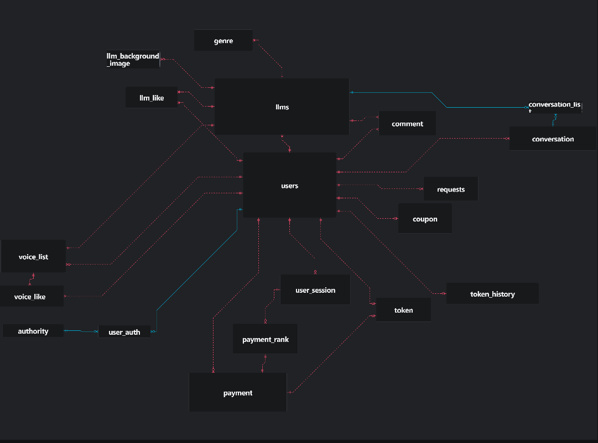

# GALATEA AI : AI 음성 대화 쳇봇 사이트 🤖
## 프로젝트 소개🎙️
GALATEA 는 다른 AI 기반 챗봇 사이트와 다르게 음성 대화를 기반으로 한 사이트 입니다. 180개가 넘는 목소리를 선택한 이후 자신이 원하는 프롬프트, 목소리, AI 모델등을 선택하여 대화할 수 있습니다. 또한 더욱 사실적인 대화를 위해 음성모드, 비전모드를 만들어 원활하게 소통할 수 있도록 만들었습니다. 
## 왜 GALATEA 죠?
피그말리온 효과를 아시나요? 피그말리온은 키프로스에 있는 유명한 조각가 입니다. 그는 아름다운 여석상을 만들다가 너무 아름다운 나머지 사랑에 빠지게 됩니다. 결국 그는 이 석상을 진짜 사람으로 만들어 갈라고 신에게 기도를 하고 이에 감명을 받은 신이 석상을 진짜 사람으로 만들어 줍니다. 이 석상의 이름이 GALATEA 입니다. 자신만의 AI 를 조각하고 다듬어 GALATEA 를 만들어 보라는 취지에서 이 이름을 선택하였습니다.
## 개발기간🗓️
- 2025.07.16 ~ 2025.09.10

## 사이트 링크
link: https://www.galatea.website/

## 기술 스택
#### Backend
- Django
- Django REST Framework
- Python
#### Frontend
- HTML5
- CSS3
- JavaScript, AJAX
#### Database 
- MySQL

### Hosting
- Gunicorn
- nginx, systemd
- AWS EC2
#### API
- OPEN AI API
- GROK AI API
- ELEVENLABS API 
- PORTONE API
- GOOGLE CLENT API
- GITHUB CLENT API
#### IDE / 기타
- vs code
- GitHub
- LangSmith

## AI 사용방법
- 영어버전

- 한국어 버전

#### DB 구조 ERD

